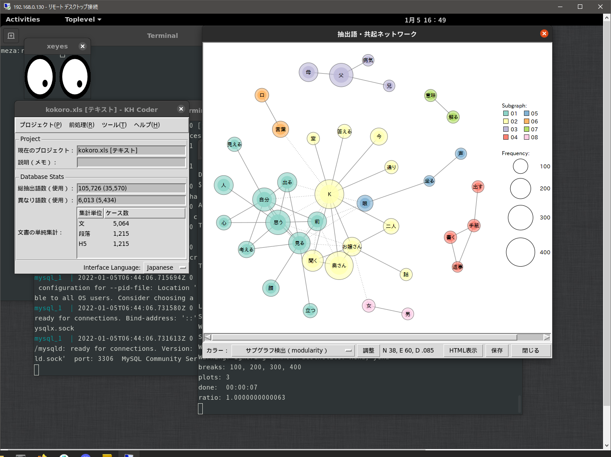

# KH Coder in Docker
Docker の KH Coder を提供した
docker-compose up したのち次の複雑な作業をする。
また docker として host タイプのネットワークを使っている事にも注意。

## KH Coder のインストール
mysql 8.0.27 対応にした。
KH Coder は接続後 khc1 などのデータベースを対象毎に作成する。
mysql に root で接続して create database を実行する。
セキュリティ強化された mysql 8.0.27 で実行するのは工夫が必要。
そういった場合、どうすればいいのかよくわからなかったので、
とりあえず khcoder という接続用のデータベースを作った。
それに接続するためにパッチを作ってしまった。
後で検証すると DB 名は mysql でよく、パッチそのものは
必要な胃みたいだ。後で再確認する必要がある。
とりあえずここでは成功した例をあげておく。

なお、この変更の為 mysql で初期化が必要になった。
create database と create user と grant。
特に grant はセキュリティに関わるので注意。

```
$ git submodule init
$ git submodule update
$ cd KHCoder/khcoder
$ patch -p1 << ../../khcoder.diff
```

## mysql の設定

```
$ docker cp mysql.txt nl2e_nl2e_1:/
$ docker exec -it nl2e_nl2e_1 /bin/bash
# mysql --host 0.0.0.0 -P 13306 -u root -p < mysql.txt
# cd /KHCoder/khcoder/
# /usr/bin/perl ./kh_coder.pl
```


## チュートリアルをやってみる

```
% mkdir KHCoder/works
% cd KHCoder/works
% wget https://khcoder.net/tutorial_data_3x.zip
% unzip -x tutorial_data_3x.zip
```


